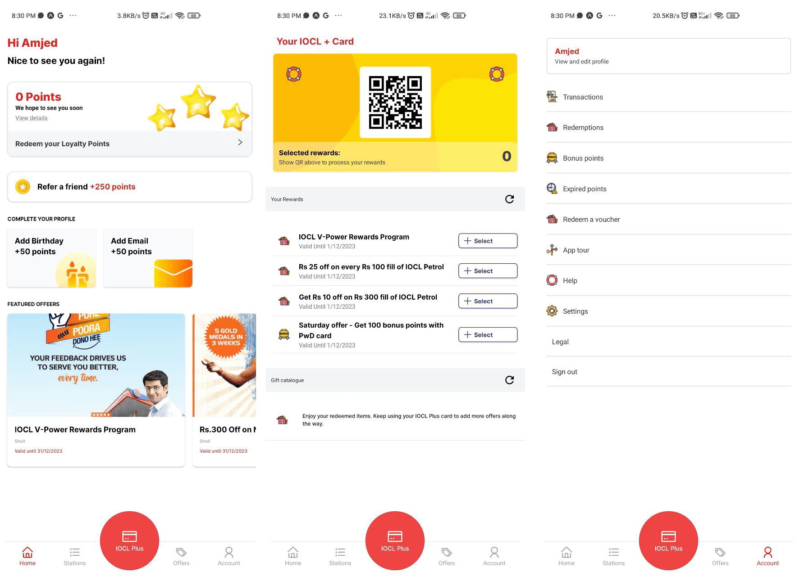

<!-- Show image ./screenshot.png -->

# ALDS App - Shell Asia app clone

This is a clone of the Shell Asia app. It is a simple app that shows a list of items and a detail view for each item.

#### Environment


#### Technologies


#### Tools


#### IDE


<!-- Expo app docs  -->
<!-- Install dev enviornament -->

## Install

```bash
npm install
```

## Run

```bash
npm start
```

## Screenshot


